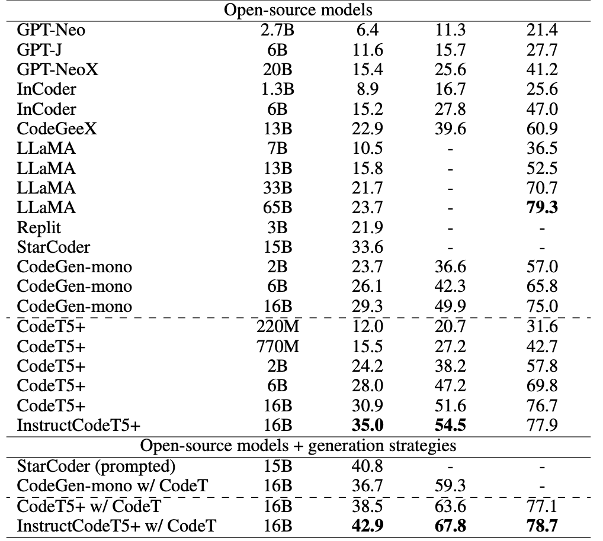

# DataChat

An open-source software for data analysis using natural language queries.

## Code Large Language Models

- [Salesforce CodeT5](https://github.com/salesforce/CodeT5/)
- [Why Salesforce](https://arxiv.org/pdf/2305.07922.pdf)
- Instruct Code T5+, Embeddings Code T5 +

### Results

## Tools

- [Streamlit.io](https://blog.streamlit.io/)
- [LangChain](https://www.langchain.com/)

## Planning

- User uploads dataset
- Get a user query
- Create code to execute query
- Execute the query
- Show results

## LLMs Deployment

- [LC x HF Text Generation](https://python.langchain.com/docs/integrations/llms/huggingface_textgen_inference)
- [Hugging Face CodeT5p-16B](https://huggingface.co/Salesforce/instructcodet5p-16b)

- https://huggingface.co/docs/text-generation-inference/installation
- https://huggingface.co/blog/inference-endpoints-llm

## Next steps

- Deploy a custom LLM on Huggingface
- Use deployed model to build the repository